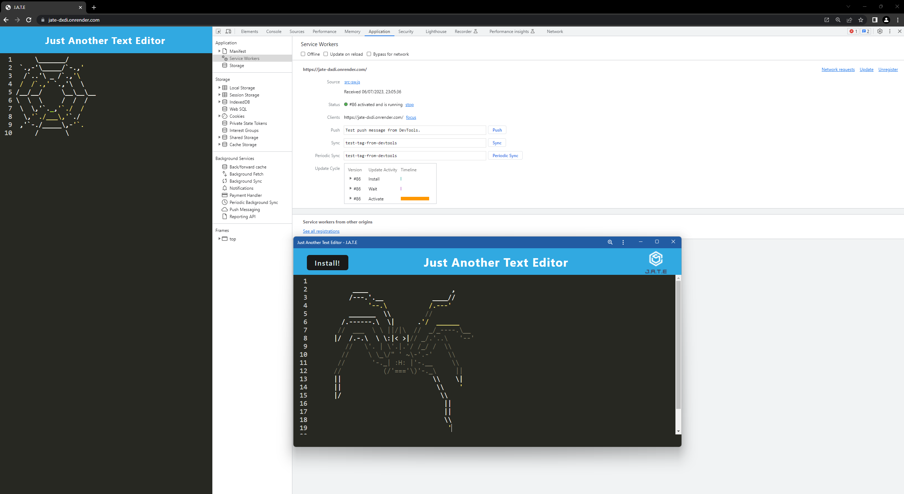

# Just Another Text Editor (JATE)

JATE is a text editor web application that allows you to create and edit text documents with offline capabilities using IndexedDB. It provides a simple and intuitive interface for managing your text files.

## Live Demo

Check out the live demo of JATE: [https://jate-dxdi.onrender.com/](https://jate-dxdi.onrender.com/)

## Getting Started

To run JATE locally, follow these steps:

1. Clone this repository to your local machine.
2. Navigate to the project root directory in your terminal.
3. Run the following command to install the dependencies:

    ```bash
    npm install
    ```

4. Start the development server by running:

    ```bash
    npm run start
    ```

5. Open your web browser and visit [http://localhost:3000](http://localhost:3000) to access JATE.

## Features

- **Next-gen JavaScript**: JATE is built using modern JavaScript syntax and features, ensuring a smooth and efficient user experience.
- **IndexedDB Integration**: JATE utilizes IndexedDB for offline storage, allowing you to access and edit your text files even when you're offline.

## Contributing

Contributions are welcome! If you find any bugs or have suggestions for improvement, please open an issue or submit a pull request.

## License

This project is licensed under the [MIT License](LICENSE).

